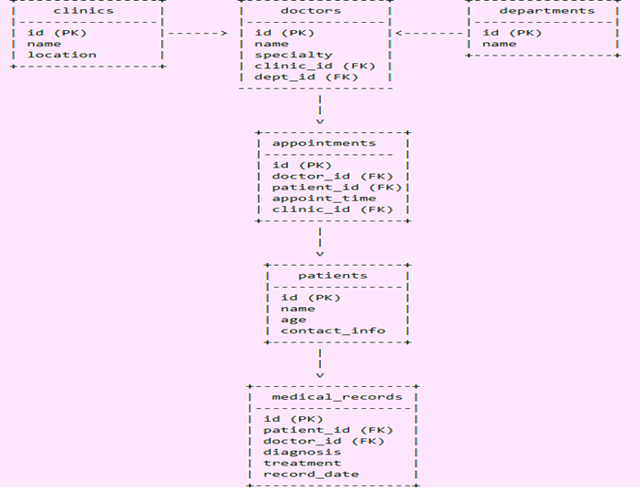

# Design Document

By Constantina Dretakis

Video overview: <URL https://youtu.be/wlTrdOdz6y4 >

## Scope

The purpose of this "Medical Clinics Database" is to efficiently manage key information related to:the medical appointments, patients, doctors, clinics, medical records, and departments within a healthcare facility.

It aims to streamline operations, facilitate scheduling, track medical history
and enhance the overall management of patient care in an Electronic Health Records (EHR) system.

INCLUSIONS: The database includes the following:

•     People: Patients, doctors, medical staff (such as nurses), and clinic administrators.

•     Places: Clinics where the appointments take place.

•     Appointments: Records of scheduled consultations between patients and doctors.

•     Medical Records: Information about patient diagnoses, treatments, and visits.

•     Departments: Specialized units within the clinic, such as Cardiology, Pediatrics and others

EXCLUSIONS: The database  does not include:

•     Billing and Payments: It does not store or process financial transactions, insurance claims, or billing details.

•     Medication and Pharmacy: It does not track prescriptions, medication inventories, or pharmacy details.

•     Advanced Analytics or Reporting: The database does not handle in-depth data analysis, reporting, or trends.

•     Scheduling Conflicts:  this database does not handle complex appointment conflicts or room/resource management.

## Functional Requirements

This database will support: CRUD operations for users.

Users should be able to:

•     Manage Patient Data: Add, update, and view patient details, such as their name, age, contact information, and medical history.

•     Schedule Appointments: Create, update, and cancel patient appointments with doctors, as well as search for available time slots.

•     Manage Medical Records: Create, update, and retrieve patient medical records, including diagnoses, treatments, and visit details.

•     Manage Doctors and Departments: Assign doctors to clinics and departments, and view department details.

•     View Appointment Schedules: Retrieve appointment schedules for doctors, departments, or patients for a specific time period.

And Users should not be able to:

•     Handle Billing and Payments: Financial transactions, insurance information, and payment history are outside the scope.

•     Advanced Data Analysis: The database is not intended for generating advanced reports, health trends, or predictions.

•     Modify Clinic Policies: The database does not manage non-medical aspects such as staffing, payroll, or administrative policies.

## Representation

### Entities

### Attributes

      •     Primary Keys (PK): Each entity has a unique identifier to ensure data integrity and avoid duplication.

      •     Foreign Keys (FK): Relationships between tables are maintained using foreign keys, ensuring referential integrity.

      •     Attributes:  were chosen to reflect essential information for healthcare management, patient treatment, and scheduling

      •     Constraints: such us, "UNIQUE" ensures each record is uniquely identifiable and "NON NULL" for valid references

### Attributes for each entity

Clinics

      •     clinic_id (PK): Unique identifier for the clinic.

      •     name: Name of the clinic.

      •     location: Physical address of the clinic.

Doctors

      •     doctor_id (PK): Unique identifier for each doctor.

      •     first_name, last_name: Name of the doctor.

      •     specialty: Specialty or field of expertise.

      •     clinic_id (FK): The clinic where the doctor works.

      •     department_id (FK): The department to which the doctor belongs.

Patients

      •     patient_id (PK): Unique identifier for the patient.

      •     first_name, last_name: Name of the patient.

      •     age: Age of the patient.

      •     contact_info: Contact information (phone, email).

Appointments

      •     appointment_id (PK): Unique identifier for each appointment.

      •     doctor_id (FK): The doctor attending the patient.

      •     patient_id (FK): The patient being treated.

      •     appointment_time: Date and time of the appointment.

      •     clinic_id (FK): The clinic where the appointment is scheduled.

Medical Records

      •     record_id (PK): Unique identifier for each record.

      •     patient_id (FK): The patient associated with the record.

      •     doctor_id (FK): The doctor who created the record.

      •     diagnosis: Medical diagnosis for the patient.

      •     treatment: Prescribed treatment or procedures.

      •     record_date: Date of the medical consultation.

Departments

      •     department_id (PK): Unique identifier for each department.

      •     name: Name of the department (e.g., Cardiology, Neurology).

### Relationships

The relationships between these tables are as follows:

      •     Clinic -> Doctor (1:N): (one-to-many).
       A Clinic can have many Doctors, but each Doctor belongs to only one Clinic.

      •     Doctor -> Dept (1:N): (one-to-many).
      A Doctor is associated with only one Dept, but a Dept can have many Doctors.

      •     Doctor -> Appointment (1:N): (one-to-many).
      A Doctor can have many Appointments, but each Appointment is associated with only one Doctor.

      •     Patient -> Appointment (1:N): (one-to-many).
      A Patient can have many Appointments, but each Appointment is associated with only one Patient.

      •     Patient -> Med Records(1:N): (one-to-many).
      A Patient can have many Med Records (one for each appointment), but each Med Record belongs to only one Patient.

      •     Doctor -> Med Records (1:N): (one-to-many).
      A Doctor can create many Med Records, but each Med Record is associated with only one Doctor.

## Entity-Relationship Diagram "ERD"

in the file diagram.png, an "Entity-Relationship Diagram" illustrates the relationships among the entities in this database

## Optimizations

•     Indexes in all related tables for fast query performance.

•     Views:  for improving the retrieval of scheduling information.

## Limitations

•     Limited to Scheduling and Basic Medical Records: The system is not designed to handle complex workflows such as multi-step referrals, medication tracking, or advanced diagnostics.

•     No Financial or Billing Information: The database does not include billing, insurance processing, or patient payment records, which are typically handled by separate systems.

•     Scalability: The design may face performance issues when scaling up to handle a larger number of clinics, doctors, and patients, especially in high-demand systems.

# Acknowledgements:

My deepest gratitude to David Malan & Carter Zenke, to the whole CS50 support team with all the Forums and to "Duck".

